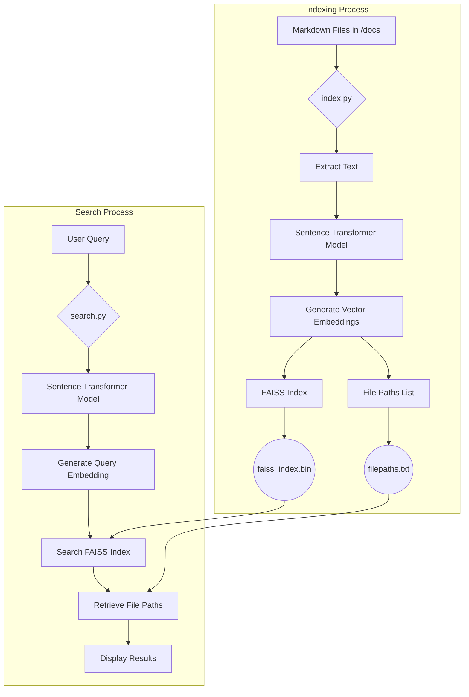

# Project Architecture

This document outlines the architecture of the markdown semantic search tool. The system is divided into two main processes: the **Indexing Process** and the **Search Process**.

## System Components

-   **Markdown Files (`/docs`)**: The source of unstructured text data.
-   **Sentence Transformer (`all-MiniLM-L6-v2`)**: A pre-trained model that converts text into high-dimensional vector embeddings.
-   **FAISS Index (`faiss_index.bin`)**: A library for efficient similarity search. We use it to store and search through the text embeddings.
-   **File Paths (`filepaths.txt`)**: A simple text file that maps the indices in the FAISS database back to their original file paths.
-   **Indexing Script (`index.py`)**: The script responsible for reading markdown files, generating embeddings, and building the FAISS index.
-   **Search Script (`search.py`)**: The script that takes a user query, converts it to an embedding, and searches the FAISS index for the most relevant documents.

## Workflow Diagram

The following Mermaid diagram illustrates the flow of data through the system for both indexing and searching.

## Detailed Process Description

### 1. Indexing Process

1.  **Input**: A folder containing markdown (`.md`) files.
2.  **Execution**: The user runs `python3 index.py --folder ./docs`.
3.  **File Discovery**: The script recursively scans the specified folder for all markdown files.
4.  **Content Extraction**: The text content is extracted from each markdown file, stripping away the markdown syntax.
5.  **Vectorization**: The `SentenceTransformer` model is loaded and used to convert the extracted text from each file into a numerical vector embedding. Each vector represents the semantic meaning of the text.
6.  **Index Creation**: A FAISS index is created to store these embeddings efficiently. We use an `IndexIDMap` to associate each vector with a simple integer ID.
7.  **Data Storage**:
    -   The FAISS index is saved to disk as `faiss_index.bin`.
    -   A corresponding list of the original file paths is saved to `filepaths.txt`. The line number in this file corresponds to the ID in the FAISS index.

### 2. Search Process

1.  **Input**: A text query from the user.
2.  **Execution**: The user runs `python3 search.py --query "your search query"`.
3.  **Load Data**: The script loads the pre-built `faiss_index.bin` and the `filepaths.txt` list.
4.  **Query Vectorization**: The same `SentenceTransformer` model is used to convert the user's text query into a vector embedding.
5.  **Similarity Search**: The FAISS index is used to search for the vectors in the database that are most similar to the query vector (based on L2 distance).
6.  **Retrieve Results**: The IDs of the top matching vectors are returned. These IDs are used as line numbers to look up the original file paths from the `filepaths.txt` list.
7.  **Output**: The paths of the most relevant files are printed to the console, along with their similarity score.
