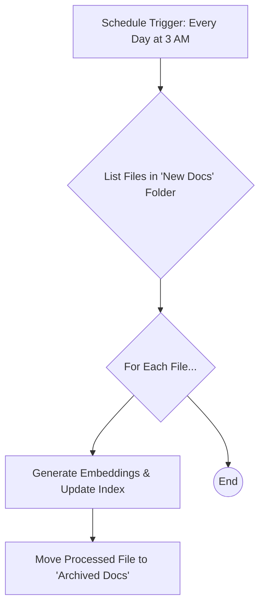

# Index Creation: Time Estimation & Automation

This document provides a formula for estimating the time required to create the initial index and outlines a strategy for automating daily incremental updates using a workflow tool like n8n.

## Part 1: Indexing Time Estimation

The time it takes to create the index depends on several factors:

-   **Number of Documents:** The primary driver of total time.
-   **Hardware Performance:** A CPU with more cores or a GPU will significantly speed up embedding generation.
-   **Document Complexity:** Very large documents take longer to read and process.
-   **Model Loading:** A one-time cost each time the script is run.

### Time Estimation Formula

A good way to model this is:

`Total Time = ModelLoadTime + (NumberOfDocuments * AverageTimePerDocument)`

-   **ModelLoadTime:** The time it takes to load the `all-MiniLM-L6-v2` model into memory. This is typically **5-15 seconds**.
-   **AverageTimePerDocument:** This is the time to read the file, process its text, and generate the vector embedding. This is the most variable part. On a modern CPU, this is very fast.

### Practical Estimation

Based on the performance of the `all-MiniLM-L6-v2` model on a standard modern CPU, we can make the following estimates:

-   **Conservative Estimate (CPU):** 0.1 to 0.2 seconds per document.
-   **Optimistic Estimate (GPU):** 0.01 to 0.05 seconds per document.

Let's estimate for **15,000 documents** on a **CPU**:

-   **Low Estimate:** `15s + (15,000 docs * 0.1 s/doc) = 15s + 1500s = 1515 seconds ≈ **25 minutes**`
-   **High Estimate:** `15s + (15,000 docs * 0.2 s/doc) = 15s + 3000s = 3015 seconds ≈ **50 minutes**`

So, for an initial indexing of 15,000 documents, you should budget between **25 to 50 minutes** on a standard CPU. A GPU would reduce this time dramatically, likely to under 5-10 minutes.

---

## Part 2: Reusable Index with Daily Updates (n8n Workflow)

Re-indexing all 15,000+ documents every day to add 200 new ones is inefficient. The optimal solution is **incremental indexing**: adding only the new documents to the existing index.

This process can be automated with a workflow tool like [n8n](https://n8n.io/).

### The Strategy: Incremental Indexing

We need to modify our Python script to support an "update" mode. This script would:
1.  Load the existing `faiss_index.bin` and `filepaths.txt`.
2.  Process only a specific folder of *new* documents.
3.  Generate embeddings for these new documents.
4.  Use `index.add_with_ids()` to add the new vectors to the loaded FAISS index.
5.  Append the new file paths to `filepaths.txt`.
6.  Save the updated index and file path files.

### Proposed n8n Workflow

Here is a high-level diagram and explanation of an n8n workflow that runs daily.

**Workflow Steps in n8n:**

1.  **Schedule Trigger:**
    -   Use the **Schedule** node in n8n to trigger this workflow once every 24 hours at a set time (e.g., 3:00 AM).

2.  **Identify New Files:**
    -   Have a dedicated folder (e.g., `/new_markdown_files`) where the 200 new documents are placed daily.
    -   Use an **Execute Command** node to run a command like `ls /new_markdown_files` to get the list of new files.

3.  **Execute Incremental Indexing Script:**
    -   Create a new Python script, `update_index.py`, that is designed to process one file at a time and add it to the index.
    -   Use a **Loop Over Items** node to iterate through the list of new files from the previous step.
    -   Inside the loop, use an **Execute Command** node to call the update script for each file:
        `source venv/bin/activate && python3 update_index.py --file /new_markdown_files/{{ $json.fileName }}`

4.  **Archive Processed Files:**
    -   After a file has been successfully indexed in the loop, use another **Execute Command** node to move it from the `/new_markdown_files` folder to an archive folder (e.g., `/processed_docs`).
    -   This ensures that the same file is not processed again on the next day's run.
    -   Command: `mv /new_markdown_files/{{ $json.fileName }} /processed_docs/`

This automated workflow ensures that your semantic search index is always up-to-date, runs efficiently by only processing new files, and requires no manual intervention.
